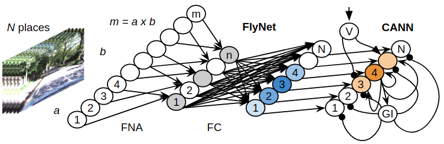

# A Hybrid Compact Neural Architecture for Visual Place Recognition

In this release, we provide an open source implementation of the FlyNet supervised learning experiments in [A Hybrid Compact Neural Architecture for Visual Place Recognition](https://arxiv.org/pdf/1910.06840.pdf), accepted for publication in the IEEE Robotics and Automation Letters (RA-L) journal (https://arxiv.org/abs/1910.06840).

## Abstract

State-of-the-art algorithms for visual place recognition, and related visual navigation systems, can be broadly split into two categories: computer-science-oriented models including deep learning or image retrieval based techniques with minimal biological plausibility, and neuroscience-oriented dynamical networks that model temporal properties found in neural cells underlying spatial navigation in the brain. In this paper, we propose a new compact and high-performing place recognition hybrid model that bridges this divide for the first time. Our approach comprises two key components that incorporate neural models of these two categories: (1) FlyNet, a compact, sparse two-layer neural network inspired by brain architectures of fruit flies, Drosophila melanogaster, and (2) a one-dimensional continuous attractor neural network (CANN). The resulting FlyNet+CANN network combines the compact pattern recognition capabilities of our FlyNet model with the powerful temporal filtering capabilities of an equally compact CANN, replicating entirely in a hybrid neural implementation the functionality that yields high performance in algorithmic localization approaches like SeqSLAM. We evaluate our approach, and compare it to three state-of-the-art place recognition methods, on two benchmark real-world datasets with small viewpoint variations and extreme environmental changes; including day/night cycles where it achieves an AUC performance of 87% compared to 60% for Multi-Process Fusion, 46% for LoST-X and 1% for SeqSLAM, while being 6.5, 310, and 1.5 times faster respectively.

## Datasets

The dataset needed to run this code can be downloaded from
[here](https://drive.google.com/open?id=1xrHKrHYgSqrMk9-XeC1qIe8UYDmOsgfd), which is a small subset of the Nordland dataset. However, this code can be easily adapted to run across other much larger datasets.

## Use FlyNet

We provide a demo on a subset of the Nordland dataset.

After downloading the dataset from [here](https://drive.google.com/open?id=1xrHKrHYgSqrMk9-XeC1qIe8UYDmOsgfd), extract it into the `dataset/` folder and run:

	python main.py

## Sample results

## Requirements

This code was tested on [PyTorch](https://pytorch.org/) v1.0 and Python 3.6.

## License

FlyNet itself is released under the MIT License (refer to the LICENSE file for details).

## Citation

If you find this project useful for your research, please use the following BibTeX entry.

	@article{
		FlyNetMC19,
		author = {Chanc\'an, Marvin and Hernandez-Nunez, Luis and Narendra, Ajay and Barron, Andrew B. and Milford, Michael},
		title = {A Hybrid Compact Neural Architecture for Visual Place Recognition},
		volume = {abs/1910.06840},
		year = {2019},
		url = {https://arxiv.org/abs/1910.06840},
		archivePrefix = {arXiv},
		eprint = {1910.06840}
	}
