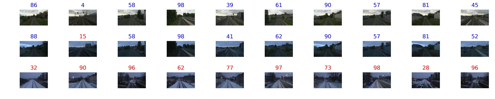

# A Hybrid Compact Neural Architecture for Visual Place Recognition

In this release, we provide an open source implementation of the FlyNet supervised learning experiments in [**A Hybrid Compact Neural Architecture for Visual Place Recognition**](https://doi.org/10.1109/LRA.2020.2967324), DOI [10.1109/LRA.2020.2967324](https://doi.org/10.1109/LRA.2020.2967324), accepted for publication in the IEEE Robotics and Automation Letters (RA-L) journal. Preprint version available at https://arxiv.org/abs/1910.06840.

Project page: https://mchancan.github.io/projects/FlyNet

## Abstract

State-of-the-art algorithms for visual place recognition, and related visual navigation systems, can be broadly split into two categories: computer-science-oriented models including deep learning or image retrieval-based techniques with minimal biological plausibility, and neuroscience-oriented dynamical networks that model temporal properties underlying spatial navigation in the brain. In this letter, we propose a new compact and high-performing place recognition model that bridges this divide for the first time. Our approach comprises two key neural models of these categories: (1) FlyNet, a compact, sparse two-layer neural network inspired by brain architectures of fruit flies, Drosophila melanogaster, and (2) a one-dimensional continuous attractor neural network (CANN). The resulting FlyNet+CANN network incorporates the compact pattern recognition capabilities of our FlyNet model with the powerful temporal filtering capabilities of an equally compact CANN, replicating entirely in a hybrid neural implementation the functionality that yields high performance in algorithmic localization approaches like SeqSLAM. We evaluate our model, and compare it to three state-of-the-art methods, on two benchmark real-world datasets with small viewpoint variations and extreme environmental changes - achieving 87% AUC results under day to night transitions compared to 60% for Multi-Process Fusion, 46% for LoST-X and 1% for SeqSLAM, while being 6.5, 310, and 1.5 times faster, respectively.

## Dataset

The dataset needed to run this code can be downloaded from
[here](https://drive.google.com/open?id=1xrHKrHYgSqrMk9-XeC1qIe8UYDmOsgfd), which is a small subset of the Nordland dataset. However, this code can easily be adapted to run across other much larger datasets.

## Dependencies

This code was tested on [PyTorch](https://pytorch.org/) v1.0 and Python 3.6.

## Use FlyNet

We provide a demo of FlyNet on the Nordland dataset. After downloading the [dataset](https://drive.google.com/open?id=1xrHKrHYgSqrMk9-XeC1qIe8UYDmOsgfd), extract it into the `dataset/` folder and run:

	python main.py

## Sample results

## License

FlyNet itself is released under the MIT License (refer to the LICENSE file for details).

## Citation

If you find this project useful for your research, please use the following BibTeX entry.

	@article{chancan2020hybrid,
		author = {M. {Chanc\'an} and L. {Hernandez-Nunez} and A. {Narendra} and A. B. {Barron} and M. {Milford}},
		journal = {IEEE Robotics and Automation Letters},
		title = {A Hybrid Compact Neural Architecture for Visual Place Recognition},
		year = {2020},
		volume = {5},
		number = {2},
		pages = {993--1000},
		keywords = {Biomimetics;localization;visual-based navigation},
		doi = {10.1109/LRA.2020.2967324},
		ISSN = {2377-3774},
		month = {April}
	}
