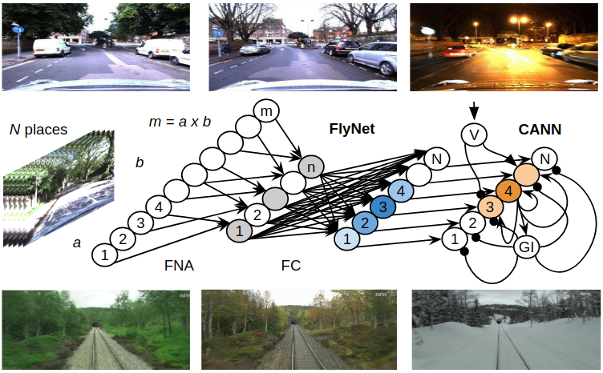

# A Hybrid Compact Neural Architecture for Visual Place Recognition



In this release, we provide an open source implementation of the FlyNet supervised learning experiments
in [A Hybrid Compact Neural Architecture for Visual Place Recognition](https://arxiv.org/pdf/1910.06840.pdf),
as submitted to RA-L with ICRA 2020 option (https://arxiv.org/abs/1910.06840).

## Abstract

State-of-the-art algorithms for visual place recognition can be broadly split into two categories: computationally expensive deep-learning/image retrieval based techniques with minimal biological plausibility, and computationally cheap, biologically inspired models that yield poor performance in real-world environments. In this paper we present a new compact and high-performing system that bridges this divide for the first time. Our approach comprises two key components: FlyNet, a compact, sparse two-layer neural network inspired by fruit fly brain architectures, and a one-dimensional continuous attractor neural network (CANN). Our FlyNet+CANN network combines the compact pattern recognition capabilities of the FlyNet model with the powerful temporal filtering capabilities of an equally compact CANN, replicating entirely in a neural network implementation the functionality that yields high performance in algorithmic localization approaches like SeqSLAM. We evaluate our approach and compare it to three state-of-the-art methods on two benchmark real-world datasets with small viewpoint changes and extreme appearance variations including different times of day (afternoon to night) where it achieves an AUC performance of 87%, compared to 60% for Multi-Process Fusion, 46% for LoST-X and 1% for SeqSLAM, while being 6.5, 310, and 1.5 times faster respectively.

## Datasets

The dataset needed to run this code can be downloaded from
[here](https://drive.google.com/open?id=1xrHKrHYgSqrMk9-XeC1qIe8UYDmOsgfd), which is a small subset of the Nordland dataset. This code can easily adapted to run across other, much larger datasets.


The files contained in the repository are the following:

*   `train.py` is where the training and logging loop happen; The file comes
    with the flags defined in Table 1 of the paper. In order to run this file
    you will need to specify where the dataset is stored and where you want to
    save the results. The results are saved in PDF format and they contains the
    ratemaps and the spatial autocorrelagram order by grid score. The units are
    ordered from higher to lower grid score. Only the last evaluation is saved.
    Please note that given random seeds results can vary between runs.

*   `data_reader.py` read the TFRecord and returns a ready to use batch, which
    is already shuffled.

*   `model.py` contains the grid-cells network

*   `scores.py` contains all the function for calculating the grid scores and
    doing the plotting.

*   `ensembles.py` contains the classes to generate the targets for training of
    the grid-cell networks.

## Train

The implementation requires an installation of
[TensorFlow](https://www.tensorflow.org/) version 1.12, and
[Sonnet](https://github.com/deepmind/sonnet) version 1.27.

```shell
$ virtualenv env
$ source env/bin/activate
$ pip install --upgrade numpy==1.13.3
$ pip install --upgrade tensorflow==1.12.0-rc0
$ pip install --upgrade dm-sonnet==1.27
$ pip install --upgrade scipy==1.0.0
$ pip install --upgrade matplotlib==1.5.2
$ pip install --upgrade tensorflow-probability==0.5.0
$ pip install --upgrade wrapt==1.9.0
```

An example training script can be executed from a python interpreter:

```shell
$ python train.py --task_root='path/to/datasets/root/folder' --saver_results_directory='path/to/results/folder'
```

## License

FlyNet itself is released under the MIT License (refer to the LICENSE file for details).


## Citation

If you find this project useful for your research, please use the following BibTeX entry.

    @article{
	FlyNetMC19,
	author = {Chanc\'an, Marvin and Hernandez-Nunez, Luis and Narendra, Ajay and Barron, Andrew B. and Milford, Michael},
	title = {A Compact Neural Architecture for Visual Place Recognition},
	volume = {abs/1910.06840},
	year = {2019},
	url = {https://arxiv.org/abs/1910.06840},
	archivePrefix = {arXiv},
	eprint = {1910.06840},
    	primaryClass = {cs.CV}
}


